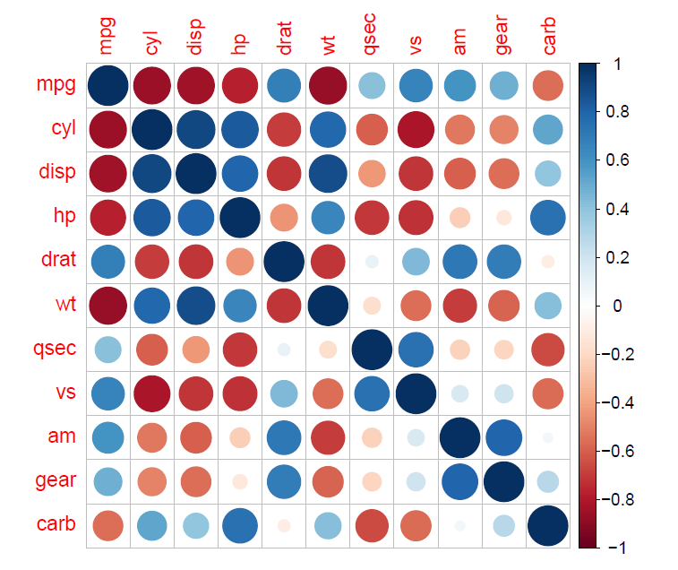

# Statistical Modeling

Projects for the course Statistical Modeling offered by the Master's program in *Data Science and Machine Learning* of the National Technical University of Athens.

Project subjects:

1. Single Variable Linear Regression
2. Multiple Variable Linear Regression
3. Generalized Linear Models (Logistic and Poisson)
